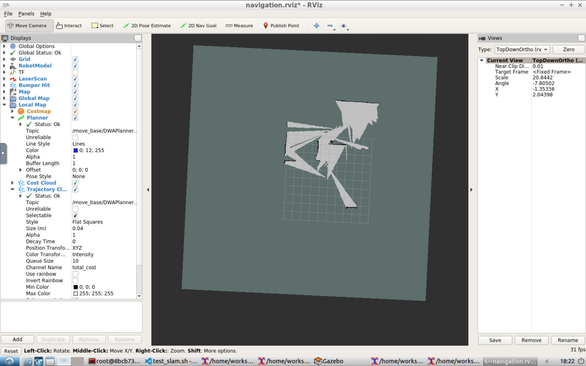
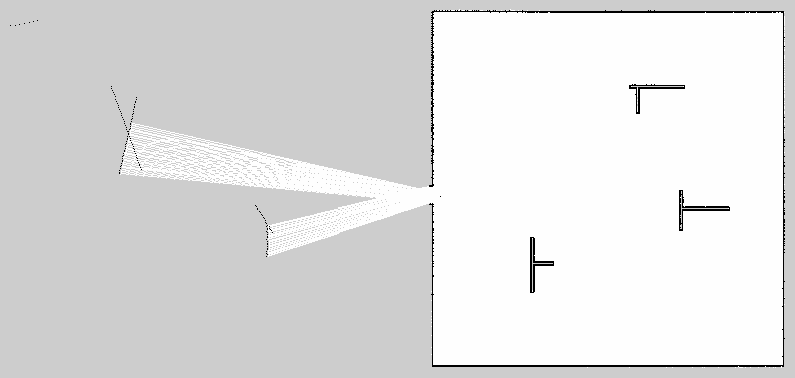
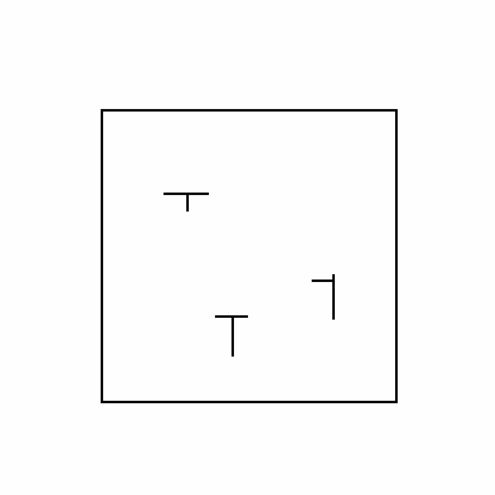

# RobotND-Home_Service_Robot
This is the fourth and final project for the Udacity [Robotics Software Engineer](https://www.udacity.com/course/robotics-software-engineer--nd209) course. The objective of this project is to use ROS packages to instruct a robot to pick up and drop off a package at a specific location. 

## Packages used
* [slam_gmapping](https://wiki.ros.org/slam_gmapping)
* [turtlebot](https://github.com/turtlebot/turtlebot)
* [turtlebot_interactions](https://github.com/turtlebot/turtlebot_interactions)
* [turtlebot_simulator](https://wiki.ros.org/turtlebot_simulator)

## Mapping
Here are my attemps to map the world
## gmapping


## RTAB-Map


## pgm_map_creator


I used the map that **pgm_map_creator** created. It created the best looking map.


## Localization
These are the initial values to map the robot in gazebo to rviz

| initial_pose_x | initial_pose_y | initial_pose_a |
|----------------|----------------|----------------|
| 5.206          | 3.87           | -1.5708        |

## Communcation between nodes
* In the **pick_objects** node, there's a service called **go_to_xy**
* In the **add_markers** node, there's a message called **go_to_xy**
* **add_markers** node sends messages to **pick_objects** node

## How to Build
```
mkdir -p catkin_ws/src
cd catkin_ws
cp -r ../RobotND-Home_Service_Robot/src/* src/
cd src
sh install.sh
cd ..
catkin_make
```
## How to Run
Open a terminal and run the following
```
cd <path to catkin>/catkin_ws/src/scripts
./home_service.sh
```
